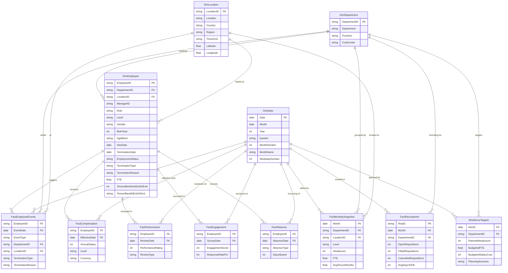

# Conceptual Data Model
## HR Workforce Planning & Attrition Dataset

---

## Table of Contents
1. [Schema Overview](#1-schema-overview)
2. [Entity Relationship Diagram](#2-entity-relationship-diagram)
3. [Table Classification](#3-table-classification)
4. [Grain Definitions](#4-grain-definitions)
5. [Relationships & Cardinality](#5-relationships--cardinality)
6. [Analytical Domain Mapping](#6-analytical-domain-mapping)
7. [Power BI Relationship Configuration](#7-power-bi-relationship-configuration)
8. [Key Design Decisions](#8-key-design-decisions)

---

## 1. Schema Overview

The dataset follows a **modified star schema** with shared dimension tables fanning out to multiple independent fact tables. The architecture is optimised for HR analytics workloads where the same employee, department, and location attributes need to slice across multiple measurement domains (headcount, events, compensation, performance, engagement, absence, recruitment).

```
┌─────────────────────────────────────────────────┐
│             DIMENSION LAYER                      │
│  DimEmployee  DimDepartment  DimLocation  DimDate│
└────────────┬──────────────────┬──────────────────┘
             │  1:M             │  1:M
             ▼                  ▼
┌─────────────────────────────────────────────────┐
│               FACT LAYER                         │
│  FactMonthlySnapshot   FactEmployeeEvents        │
│  FactCompensation      FactPerformance           │
│  FactEngagement        FactAbsence               │
│  FactRecruitment                                 │
└─────────────────────────────────────────────────┘
             │
             ▼
┌─────────────────────────────────────────────────┐
│            PLANNING LAYER                        │
│              WorkforceTargets                    │
└─────────────────────────────────────────────────┘
```

**Pattern**: Galaxy schema (fact constellation) — multiple fact tables share the same dimension tables, enabling cross-domain analysis within a single Power BI model.

---

## 2. Entity Relationship Diagram



---

## 3. Table Classification

| Table | Type | Rows | Purpose |
|---|---|---|---|
| **DimEmployee** | 📋 Employee Dimension | 1,200 | Master employee profiles (SCD Type 1) |
| **DimDepartment** | 📋 Department Dimension | 8 | Department hierarchy and cost centre mapping |
| **DimLocation** | 📋 Location Dimension | 6 | Office and remote location attributes |
| **DimDate** | 🗓️ Date Dimension | 1,096 | Calendar intelligence (2023–2025) |
| **FactMonthlySnapshot** | 📊 Aggregate Fact | 6,826 | Monthly headcount, FTE, and tenure snapshots |
| **FactEmployeeEvents** | 📊 Transaction Fact | 1,406 | Individual hire and termination events |
| **FactCompensation** | 📊 Periodic Fact | 2,914 | Annual salary records per employee |
| **FactPerformance** | 📊 Periodic Fact | 2,741 | Annual performance review ratings |
| **FactEngagement** | 📊 Periodic Fact | 10,200 | Quarterly engagement survey results |
| **FactAbsence** | 📊 Transaction Fact | 2,755 | Individual absence events |
| **FactRecruitment** | 📊 Aggregate Fact | 288 | Monthly recruitment pipeline by department |
| **WorkforceTargets** | 🎯 Planning Table | 288 | Headcount, FTE and salary budget targets |

---

## 4. Grain Definitions

Grain is the most atomic level of detail stored in each table — critical to understand before building DAX measures.

| Table | Grain (One row per…) | Date Column |
|---|---|---|
| DimEmployee | Employee (ever) | HireDate / TerminationDate |
| DimDepartment | Department | — |
| DimLocation | Office location | — |
| DimDate | Calendar day | Date |
| FactMonthlySnapshot | Month × Department × Location × Level | Month |
| FactEmployeeEvents | Employee lifecycle event (hire or exit) | EventDate |
| FactCompensation | Employee × Salary review date | EffectiveDate |
| FactPerformance | Employee × Annual review | ReviewDate |
| FactEngagement | Employee × Quarterly survey | SurveyDate |
| FactAbsence | Employee × Absence episode | AbsenceDate |
| FactRecruitment | Month × Department | Month |
| WorkforceTargets | Month × Department | Month |

---

## 5. Relationships & Cardinality

### Primary Relationships

| From Table | Key | To Table | Key | Cardinality | Active? |
|---|---|---|---|---|---|
| DimEmployee | DepartmentID | DimDepartment | DepartmentID | Many:1 | ✅ Yes |
| DimEmployee | LocationID | DimLocation | LocationID | Many:1 | ✅ Yes |
| FactMonthlySnapshot | DepartmentID | DimDepartment | DepartmentID | Many:1 | ✅ Yes |
| FactMonthlySnapshot | LocationID | DimLocation | LocationID | Many:1 | ✅ Yes |
| FactMonthlySnapshot | Month | DimDate | Month | Many:Many | ✅ Yes |
| FactEmployeeEvents | EmployeeID | DimEmployee | EmployeeID | Many:1 | ✅ Yes |
| FactEmployeeEvents | EventDate | DimDate | Date | Many:1 | ✅ Yes |
| FactEmployeeEvents | DepartmentID | DimDepartment | DepartmentID | Many:1 | ⚠️ Inactive* |
| FactEmployeeEvents | LocationID | DimLocation | LocationID | Many:1 | ⚠️ Inactive* |
| FactCompensation | EmployeeID | DimEmployee | EmployeeID | Many:1 | ✅ Yes |
| FactCompensation | EffectiveDate | DimDate | Date | Many:1 | ✅ Yes |
| FactPerformance | EmployeeID | DimEmployee | EmployeeID | Many:1 | ✅ Yes |
| FactPerformance | ReviewDate | DimDate | Date | Many:1 | ✅ Yes |
| FactEngagement | EmployeeID | DimEmployee | EmployeeID | Many:1 | ✅ Yes |
| FactEngagement | SurveyDate | DimDate | Date | Many:1 | ✅ Yes |
| FactAbsence | EmployeeID | DimEmployee | EmployeeID | Many:1 | ✅ Yes |
| FactAbsence | AbsenceDate | DimDate | Date | Many:1 | ✅ Yes |
| FactRecruitment | DepartmentID | DimDepartment | DepartmentID | Many:1 | ✅ Yes |
| FactRecruitment | Month | DimDate | Month | Many:1 | ✅ Yes |
| WorkforceTargets | DepartmentID | DimDepartment | DepartmentID | Many:1 | ✅ Yes |
| WorkforceTargets | Month | DimDate | Month | Many:1 | ✅ Yes |

> [!NOTE]
> **\* Inactive Relationships**: `FactEmployeeEvents` already connects to `DimDepartment` and `DimLocation` via `DimEmployee`. Direct FK columns in the event table (DepartmentID, LocationID) should be set to **inactive** in Power BI to avoid ambiguity. Use `USERELATIONSHIP()` in DAX when needed.

### Self-Referencing Relationship (Manager Hierarchy)

| From | Key | To | Key | Cardinality | Notes |
|---|---|---|---|---|---|
| DimEmployee | ManagerID | DimEmployee | EmployeeID | Many:1 (self-join) | Manager hierarchy; use Power BI hierarchy or PATH() |

---

## 6. Analytical Domain Mapping

The dataset supports six core analytical domains, each powered by a combination of tables:

```mermaid
graph TD
    A[🎯 Analytical Domains] --> B[📈 Workforce Growth]
    A --> C[⚠️ Attrition Risk]
    A --> D[💰 Compensation]
    A --> E[⭐ Performance & Engagement]
    A --> F[🏥 Absence & Wellbeing]
    A --> G[🧲 Recruitment]

    B --> B1[FactMonthlySnapshot]
    B --> B2[WorkforceTargets]
    B --> B3[DimEmployee]

    C --> C1[FactEmployeeEvents]
    C --> C2[DimEmployee]
    C --> C3[FactEngagement]

    D --> D1[FactCompensation]
    D --> D2[DimEmployee]
    D --> D3[WorkforceTargets]

    E --> E1[FactPerformance]
    E --> E2[FactEngagement]
    E --> E3[DimEmployee]

    F --> F1[FactAbsence]
    F --> F2[FactEngagement]
    F --> F3[DimEmployee]

    G --> G1[FactRecruitment]
    G --> G2[FactEmployeeEvents]
    G --> G3[WorkforceTargets]
```



| Analytical Domain | Primary Tables | Secondary Tables | Key Questions |
|---|---|---|---|
| **Workforce Growth** | FactMonthlySnapshot, WorkforceTargets | DimEmployee, DimDate | How has headcount/FTE trended? Where are we vs plan? |
| **Attrition Risk** | FactEmployeeEvents, DimEmployee | FactEngagement, FactPerformance | Who is leaving? Why? Which segments are at risk? |
| **Compensation** | FactCompensation | DimEmployee, WorkforceTargets | Are salaries competitive? Is there level compression? |
| **Performance & Engagement** | FactPerformance, FactEngagement | DimEmployee, FactEmployeeEvents | Do low engagement scores predict exits? |
| **Absence & Wellbeing** | FactAbsence | FactEngagement, DimEmployee | Are absence rates a leading indicator of attrition? |
| **Recruitment** | FactRecruitment | WorkforceTargets, FactEmployeeEvents | Is recruitment filling the pipeline fast enough? |

---

## 7. Power BI Relationship Configuration

### Recommended Model Layout (Power BI Desktop)

```
                    DimDate
                   /   |   \   \   \   \
                  /    |    \   \   \   \
    FactMonthlySnapshot |  FactEmployeeEvents
                        |        |
              FactRecruitment   DimEmployee ───── DimDepartment
              WorkforceTargets       |    \─────── DimLocation
                              FactCompensation
                              FactPerformance
                              FactEngagement
                              FactAbsence
```

### Configuration Checklist

| Setting | Recommendation |
|---|---|
| **Filter direction** | Single direction (Dim → Fact) for all relationships |
| **Cross-filter direction** | Use bidirectional ONLY for DimEmployee ↔ FactEmployeeEvents if needed |
| **Date table** | Mark `DimDate` as the official Date Table in Power BI |
| **Inactive relationships** | FactEmployeeEvents.DepartmentID → DimDepartment (keep inactive, use USERELATIONSHIP) |
| **Role-playing dimensions** | DimDate used for multiple date columns — create calculated tables or use USERELATIONSHIP for EffectiveDate, ReviewDate, SurveyDate, AbsenceDate |
| **Manager hierarchy** | Create a calculated column using PATH() for org hierarchy drill-down |
| **Snowflake denormalisation** | Department and Location are partially denormalised into fact tables — use only the DimDepartment/DimLocation relationships; ignore embedded text columns in facts |

> [!IMPORTANT]
> **Role-Playing Date Dimension**: `DimDate` connects to multiple date columns across the fact tables (EventDate, EffectiveDate, ReviewDate, SurveyDate, AbsenceDate). In Power BI, only one active relationship per table pair is allowed. Create **inactive relationships** for non-primary dates and activate them via `USERELATIONSHIP()` in DAX measures as needed.

> [!TIP]
> **Denormalised Text Columns**: Several fact tables include embedded `Department` and `Location` text columns alongside the FK IDs. These are convenience columns from the source system — **use the FK relationships** to DimDepartment/DimLocation for filtering, and ignore the embedded text columns in your Power BI model to avoid duplicate filter paths.

---

## 8. Key Design Decisions

### 8.1 Why a Galaxy Schema?
Each HR analytical domain (compensation, performance, engagement, absence) has a different measurement cadence and employee coverage. A single wide fact table would introduce sparsity and complicate grain management. The galaxy schema allows each domain to be measured independently while sharing common dimensions.

### 8.2 Snapshot vs Transactional Facts
| Fact Type | Tables | Use Case |
|---|---|---|
| **Snapshot (periodic)** | FactMonthlySnapshot, WorkforceTargets, FactRecruitment | Point-in-time measures (headcount, FTE, targets) — supports period-over-period comparisons |
| **Transaction** | FactEmployeeEvents, FactAbsence | Event-based (hires, exits, absences) — supports event counting and timing analysis |
| **Accumulating** | FactCompensation, FactPerformance, FactEngagement | Records accumulate over an employee's lifetime — supports longitudinal analysis |

### 8.3 Attrition Calculation Strategy
The dataset supports two attrition calculation approaches:

- **Stock approach**: Use `DimEmployee.EmploymentStatus` for current state
- **Flow approach**: Use `FactEmployeeEvents.EventType = 'Termination'` for period-specific exit counts

> [!IMPORTANT]
> For accurate rolling attrition rates in Power BI, use the **flow approach** (FactEmployeeEvents) divided by the average headcount from FactMonthlySnapshot. This avoids double-counting re-hires and handles partial periods correctly.

### 8.4 Restructuring Segmentation
The `PlanningScenario = 'Post-restructuring reset'` flag in WorkforceTargets (24 records) and the dominant `TerminationReason = 'Company Restructuring'` (95 exits) together mark a discrete restructuring event. Always **segment involuntary/structural exits from organic voluntary attrition** in retention analyses to avoid misleading attrition KPIs.
